# Sporeus Architecture Seam Map

Cross-block data flow between P1–P8. Arrows represent data dependencies.  
Useful for: onboarding new contributors, spotting tangles, understanding blast radius of changes.

## Mermaid Diagram

```mermaid
flowchart TD
    %% ── Inputs ───────────────────────────────────────────────────────────────
    TL[(training_log)]
    REC[(recovery)]
    INJ[(injuries)]
    TES[(test_results)]
    ACT[(activity_upload_jobs)]

    %% ── P1: Activity Uploads ────────────────────────────────────────────────
    subgraph P1["P1 — Activity Uploads"]
        direction LR
        UA["UploadActivity.jsx\n(client)"]
        PA["parse-activity\n(edge fn)"]
        STG[("Storage\nactivity-uploads")]
    end

    UA -- "upload file" --> STG
    UA -- "INSERT pending" --> ACT
    STG -- "Storage path" --> PA
    PA -- "UPDATE status: parsing→done/error" --> ACT
    ACT -- "realtime UPDATE" --> UA

    %% ── P2: AI Session Analysis ─────────────────────────────────────────────
    subgraph P2["P2 — AI Session Analysis"]
        direction LR
        AS["analyse-session\n(edge fn)"]
        AI[(ai_insights)]
        ANTHR["Anthropic\nClaude Haiku"]
    end

    TL -- "INSERT webhook\n{session_id, user_id}" --> AS
    AS -- "GET subscription_tier" --> PROF[(profiles)]
    AS -- "GET injuries" --> INJ
    AS -- "GET coach plan" --> CP[(coach_plans)]
    AS --> ANTHR
    ANTHR --> AS
    AS -- "UPSERT session_analysis" --> AI
    AS -- "UPSERT coach_session_flag" --> AI

    %% ── P3: Embeddings ──────────────────────────────────────────────────────
    subgraph P3["P3 — Semantic Embeddings"]
        direction LR
        ES["embed-session\n(edge fn)"]
        SE[(session_embeddings)]
        IE[(insight_embeddings)]
        OPENAI["OpenAI\ntext-embedding-3-small"]
    end

    TL -- "INSERT webhook\n{session_id, user_id}" --> ES
    AS -- "fire-and-forget\n{insight_only:true}" --> ES
    ES --> OPENAI
    OPENAI --> ES
    ES -- "UPSERT" --> SE
    ES -- "UPSERT (C1 closure)" --> IE
    AI -- "SELECT WHERE session_id" --> ES

    %% ── P4: Realtime Squad ──────────────────────────────────────────────────
    subgraph P4["P4 — Realtime"]
        direction LR
        SQFD["useRealtimeSquadFeed\n(hook)"]
        SQPR["useSquadPresence\n(hook)"]
        UCHN["useMessageChannel\n(hook)"]
        CONN["ConnectionBanner\n(component)"]
        RSTS["realtimeStatus.js\n(pub-sub registry)"]
    end

    TL -- "INSERT realtime" --> SQFD
    REC -- "INSERT realtime" --> SQFD
    SQFD --> RSTS
    SQPR --> RSTS
    UCHN --> RSTS
    RSTS --> CONN

    %% ── P5: Reports & PDF ───────────────────────────────────────────────────
    subgraph P5["P5 — PDF Reports"]
        direction LR
        GR["generate-report\n(edge fn)"]
        RPT[("Storage\nreports")]
        PDF["@react-pdf\n(WeeklyAthleteReport\nMonthlySquadReport\nRaceReadinessReport)"]
    end

    TL -- "SELECT sessions" --> GR
    AI -- "SELECT insights" --> GR
    MV1 -- "SELECT ctl_42d, atl_7d" --> GR
    REC -- "SELECT HRV" --> GR
    GR --> PDF
    PDF --> RPT

    %% ── P6: pgmq Queues ─────────────────────────────────────────────────────
    subgraph P6["P6 — Message Queues"]
        direction LR
        ABW["ai-batch-worker\n(edge fn)"]
        PW["push-worker\n(edge fn)"]
        SBW["strava-backfill-worker\n(edge fn)"]
    end

    Q_AB[("pgmq\nai_batch")]
    Q_PF[("pgmq\npush_fanout")]
    Q_SB[("pgmq\nstrava_backfill")]
    Q_DLQ[("pgmq\nai_batch_dlq")]

    Q_AB --> ABW
    ABW -- "digest→UPSERT" --> WD[(weekly_digests)]
    ABW -- "DLQ on 3 failures" --> Q_DLQ
    ABW -- "error log" --> BE[(batch_errors)]

    Q_PF --> PW
    PW -- "call" --> SP["send-push\n(edge fn)"]

    Q_SB --> SBW
    SBW -- "UPSERT sessions" --> TL

    AS -- "enqueue_push_fanout" --> Q_PF
    TL -- "strava-oauth enqueues" --> Q_SB
    EAB["enqueue-ai-batch\n(edge fn, pg_cron Sun)"] --> Q_AB

    %% ── P7: FTS ──────────────────────────────────────────────────────────────
    subgraph P7["P7 — Full-Text Search"]
        direction LR
        FTS["search_everything\n(SQL fn, SECURITY INVOKER)"]
        SPL["SearchPalette.jsx\n(client)"]
    end

    TL -- "notes_tsv (GIN)" --> FTS
    CN[(coach_notes)] -- "note_tsv (GIN)" --> FTS
    MSG[(messages)] -- "body_tsv (GIN)" --> FTS
    TA[(team_announcements)] -- "message_tsv (GIN)" --> FTS
    PROF -- "name_tsv (GIN)" --> FTS
    CA[(coach_athletes)] -- "squad access check" --> FTS
    FTS --> SPL

    %% ── P8: Materialized Views ───────────────────────────────────────────────
    subgraph P8["P8 — MV Hardening"]
        direction LR
        GSO["get_squad_overview\n(SQL fn)"]
        SS["squad-sync\n(edge fn)"]
        CD["CoachDashboard.jsx\n(client)"]
        MVH["MVHealth.jsx\n(admin)"]
    end

    MV1[("mv_ctl_atl_daily\n(daily refresh)")]
    MV2[("mv_squad_readiness\n(1-min debounce)")]
    MV3[("mv_weekly_load_summary\n(daily refresh)")]
    MV_PND[("mv_refresh_pending\n(debounce signal)")]
    CTL[("ctl_daily_cache\n(per-insert trigger)")]

    TL -- "AFTER INSERT trigger" --> CTL
    REC -- "STATEMENT trigger" --> MV_PND
    INJ -- "STATEMENT trigger" --> MV_PND
    MV_PND -- "pg_cron every 1min" --> MV2
    TL -- "pg_cron daily" --> MV1
    TL -- "pg_cron daily" --> MV3

    MV2 --> GSO
    MV1 -- "LATERAL ctl7ago" --> GSO
    GSO --> SS
    SS --> CD
    MV1 --> MVH
    MV3 --> MVH

    %% ── Analytics ──────────────────────────────────────────────────────────
    subgraph ATT["Attribution"]
        direction LR
        ATTRLOG["attribution-log\n(edge fn)"]
        ATEV[(attribution_events)]
    end

    UA -- "emitEvent (fire-and-forget)" --> ATTRLOG
    ATTRLOG --> ATEV
    ATTRLOG -- "first_touch stamp" --> PROF
```

---

## Block-to-table ownership

| Table | Owning block | Written by | Read by |
|---|---|---|---|
| `training_log` | Core | Client + strava-backfill-worker + parse-activity | P2, P3, P5, P6, P7, P8 |
| `ai_insights` | P2 | analyse-session | embed-session (C1), generate-report (P5), useInsightNotifier |
| `session_embeddings` | P3 | embed-session | ai-proxy (RAG) |
| `insight_embeddings` | P3 | embed-session (C1) | ai-proxy (future) |
| `activity_upload_jobs` | P1 | Client (INSERT) + parse-activity (UPDATE) | UploadActivity (realtime) |
| `push_subscriptions` | Push | Client | send-push |
| `notification_log` | Push | DB triggers + send-push | Client (NotifReminders) |
| `mv_ctl_atl_daily` | P8 | pg_cron refresh | P5 (generate-report), P8 (get_squad_overview) |
| `mv_squad_readiness` | P8 | maybe_refresh_squad_mv | get_squad_overview |
| `weekly_digests` | P6 | ai-batch-worker | Client |
| `batch_errors` | P6 | ai-batch-worker | Admin |
| `attribution_events` | ATT | attribution-log | Analytics |

---

## High-risk seams (crossing block boundaries)

| Seam | Risk | Mitigation |
|---|---|---|
| analyse-session → embed-session (race condition) | **CRITICAL** | insight_only fire-and-forget (v8.0.1) |
| generate-report → mv_ctl_atl_daily (column names) | **HIGH** | Fixed ctl/atl/tsb → ctl_42d/atl_7d (v8.0.1) |
| search_everything → coach athlete sessions | **HIGH** | Added athlete_session arm (v8.0.1) |
| embedInsight → insight_json.text field | **HIGH** | Fixed field extraction (v8.0.1) |
| mv_squad_readiness staleness (1-min window) | MEDIUM | pg_cron debounce is by design |
| push_fanout partial send → delete failure | LOW | at-least-once delivery; downstream dedup |
| embed_backfill queue has no scheduled worker | LOW | Backfill script only; document limitation |
